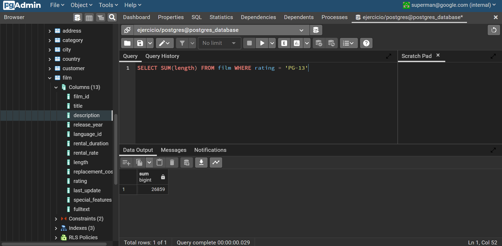

## 1. Contar cuántas películas empiezan con la letra S.

---

## 2. Sumar la duración en minutos de todas las películas clasificadas para PG-13.

---

## 3. Mostrar todos los emails de los clientes junto con la suma de todas las películas que rentaron.

---

## 4. Mostrar el número de teléfono de la dirección que tiene el código postal más grande.

---

## 5. Mostrar la dirección, el distrito y el nombre de la ciudad del primer cliente inactivo
